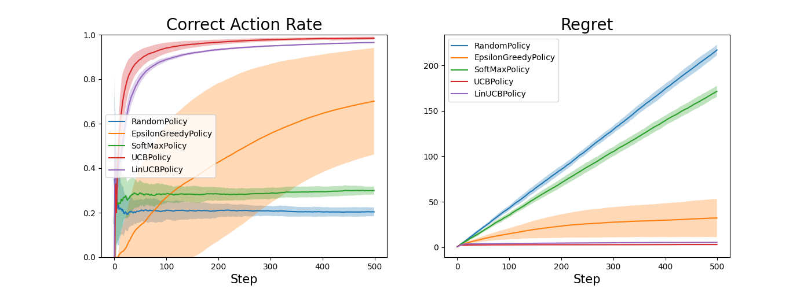
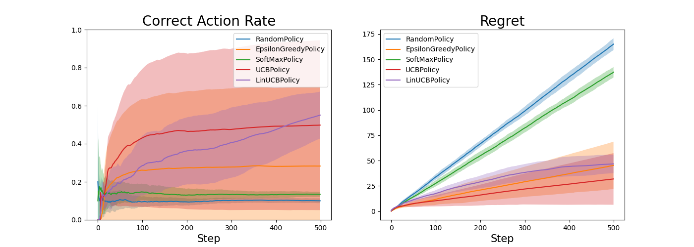
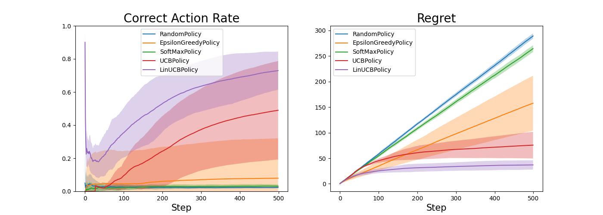
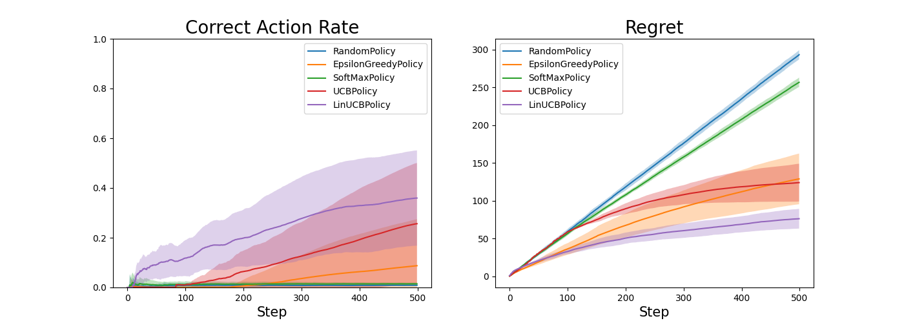

# bandit-algorithms
バンディットアルゴリズムを色々実装してみる

## 実装済みの方策
### Contextfree
- random
- epsilon-greedy
- softmax
- UCB
### Linear
- LinUCB

# Enviroment

## Requirements
- [rye](https://github.com/mitsuhiko/rye)

## Build
```bash
rye sync
```

# Usage
run default experiment
```bash
rye run python bin/run.py
```

multi run
```bash
rye run python bin/run.py -m n_actions=10,100,1000
```

# resources/default
k: 腕の数

- k=5


- k=10


- k=50


- k=100


# References
- https://github.com/st-tech/zr-obp
