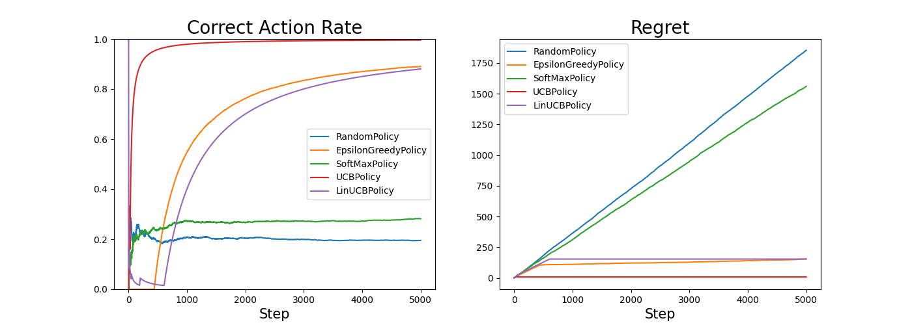
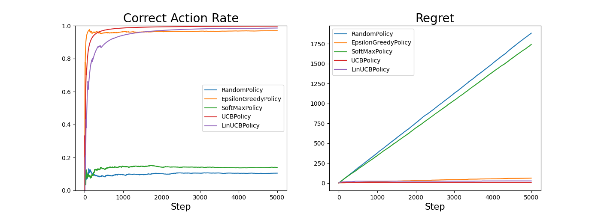
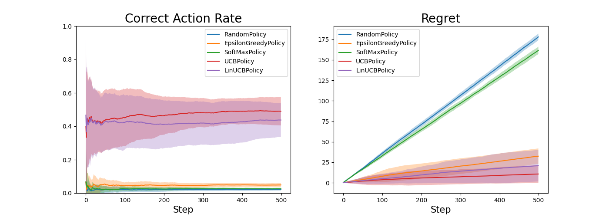
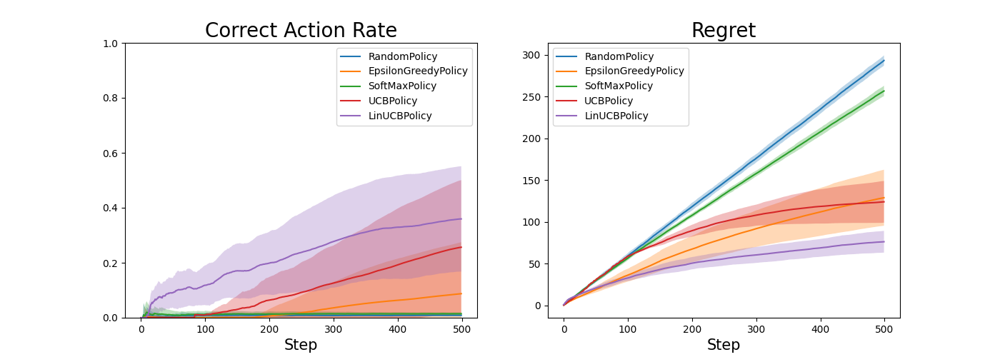

# bandit
banditを色々実装してみる

# Usage

./yaml/に設定ファイルを置く.

```yaml
# yaml/sample.yaml
seed: 3090
n_trials: 15
bs: 1 # batch size
step: 5000
n_actions: 100
dim_context: 10
dim_action_context: 15
```

実行

```bash
poetry run python bin/run.py --exp-name sample
```

# Results
k: 腕の数

- k=5


- k=10


- k=50


- k=100



